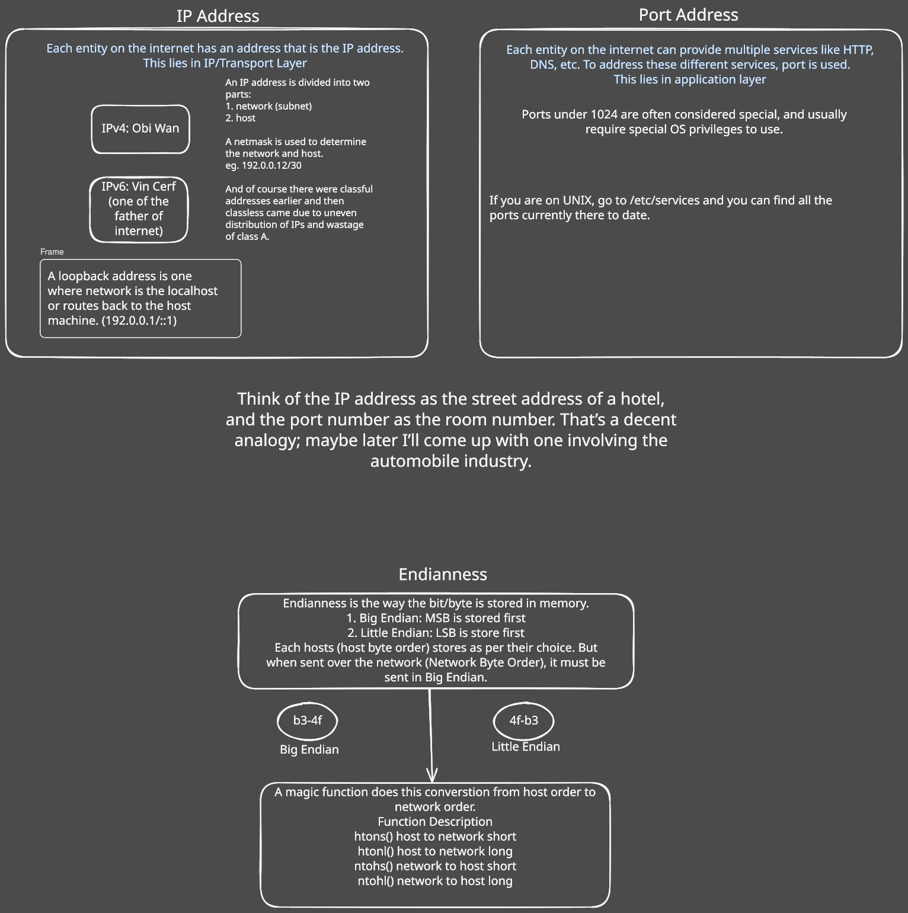
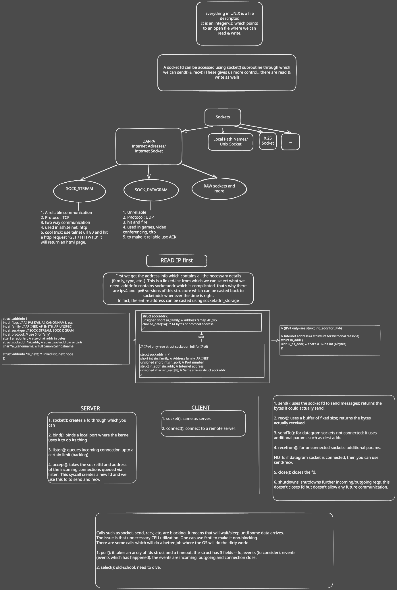

# Network Programming Fundamentals
## The Purpose

When I was at Jio, I was in the media engine team (like Agora). And most of my time was in debugging very weird bugs like sudden quality drops even though there wasn't any unexpected behaviour from server or user end (How we resolved it is not the part of this blog). 
So I wanted to understand WebRTC—how does real-time video calling work under the hood? But every article I read assumed knowledge of sockets, ports, and network layers. So I took a step back and dove into **Beej's Guide to Network Programming**; Someone from reddit suggested me. 
This is my distilled overview of what I learned.

---

## Why Start Here?

WebRTC is built on top of UDP sockets, ICE candidates, STUN/TURN servers—all concepts that assume you understand the fundamentals. Before you can appreciate *why* WebRTC works the way it does, you need to understand:

1. **How machines find each other** (IP addresses)
2. **How services are identified** (ports)
3. **How data flows** (sockets and protocols)

Let's build this foundation.

---

## Part 1: IP Addresses — Finding Machines on the Internet

Every device on the internet needs a unique identifier. That's your IP address.



### The Two Versions

- **IPv4**: The original (32-bit) — looks like `192.168.1.1`
- **IPv6**: The future (128-bit) — looks like `2001:0db8:85a3::8a2e:0370:7334`

Fun fact: IPv6 was championed by Vint Cerf, one of the "fathers of the internet."

### Anatomy of an Address

Every IP address has two parts:
1. **Network portion** — which network you're on
2. **Host portion** — which specific machine

A **netmask** tells you where the split is. For example:
- `192.168.1.0/24` means 24 bits for network, 8 bits for hosts (254 usable addresses)

### Special Addresses

- **Loopback** (`127.0.0.1` or `::1`): Routes back to yourself—great for testing
- **Private ranges**: `10.x.x.x`, `192.168.x.x`—used inside local networks

> 💡 **Analogy**: Think of an IP address as a hotel's street address. It gets you to the building, but you still need a room number.

---

## Part 2: Ports — Finding Services on a Machine

A single server can run many services: web server, database, SSH. How do clients know which one to talk to? **Ports**.

- Ports are 16-bit numbers (0-65535)
- They exist at the **Transport Layer**
- Combined with IP, they form a **socket address**: `192.168.1.1:8080`

### Well-Known Ports

Ports under 1024 require root/admin privileges:

| Port | Service |
|------|---------|
| 22 | SSH |
| 80 | HTTP |
| 443 | HTTPS |
| 53 | DNS |

> 📁 On Unix systems, check `/etc/services` for the full list.

---

## Part 3: Byte Order — A Subtle Gotcha

Different CPU architectures store bytes differently:

- **Big Endian**: Most significant byte first (Network Byte Order) in memory
- **Little Endian**: Least significant byte first (x86 processors) in memory

Each hosts store the bytes in its own byte order. But when sending data over the network, you **must** convert to Big Endian. There are helper functions for this:

```c
htons()  // host to network - short (16-bit)
htonl()  // host to network - long (32-bit)
ntohs()  // network to host - short
ntohl()  // network to host - long
```

Forget this, and your port numbers will look completely wrong on the receiving end!

---

## Part 4: Sockets — The Heart of Network Programming

Everything in Unix is a file descriptor (fd). It is an integer/ID which points to an open file where we can read & write. Sockets are no exception—they're just file descriptors that let you send and receive data over a network.



### Two Types of Sockets (Internet Sockets)

| Type | Protocol | Use Case |
|------|----------|----------|
| `SOCK_STREAM` | TCP | Reliable, ordered delivery (HTTP, SSH, TELNET) |
| `SOCK_DGRAM` | UDP | Fast, unreliable (games, video, **WebRTC!**) |

### The Key Data Structures

Before making socket calls, we need to understand how addresses are represented in C:

#### Getting Address Info: `struct addrinfo`

First, we get the address info which contains all the necessary details (family, type, etc.). This is a **linked-list** from which we can select what we need:

```c
struct addrinfo {
    int     ai_flags;      // AI_PASSIVE, AI_CANONNAME, etc.
    int     ai_family;     // AF_INET, AF_INET6, AF_UNSPEC
    int     ai_socktype;   // SOCK_STREAM, SOCK_DGRAM
    int     ai_protocol;   // Use 0 for "any"
    size_t  ai_addrlen;    // Size of ai_addr in bytes
    struct sockaddr *ai_addr;       // struct sockaddr_in or _in6
    char    *ai_canonname; // Full canonical hostname
    struct addrinfo *ai_next;       // Linked list, next node
};
```

#### The Socket Address: `struct sockaddr`

`addrinfo` contains `sockaddr` which is complicated. There are IPv4 and IPv6 versions of this structure which can be casted back to `sockaddr` when needed. The entire address can be casted using `sockaddr_storage`.

```c
struct sockaddr {
    unsigned short sa_family;   // Address family, AF_xxx
    char           sa_data[14]; // 14 bytes of protocol address
};
```

#### IPv4 Address: `struct sockaddr_in`

For IPv4, we use `sockaddr_in` which is the same size as `struct sockaddr`:

```c
struct sockaddr_in {
    short          sin_family;   // Address family, AF_INET
    unsigned short sin_port;     // Port number (network byte order!)
    struct in_addr sin_addr;     // Internet address
    unsigned char  sin_zero[8];  // Same size as struct sockaddr
};

// IPv4 only - the in_addr structure
struct in_addr {
    uint32_t s_addr;  // That's a 32-bit int (4 bytes)
};
```

### Server Lifecycle

1. **`socket()`** — Creates a file descriptor through which you can communicate
2. **`bind()`** — Binds a local port where the kernel uses it to do its thing
3. **`listen()`** — Queues incoming connections up to a certain limit (backlog)
4. **`accept()`** — Takes the socket fd and address of the incoming connections queued via listen. This syscall creates a **new fd** and we use this fd to send and recv

### Client Lifecycle

1. **`socket()`** — Same as server, creates the endpoint
2. **`connect()`** — Connect to a remote server

### Data Transfer Functions

| Function | Description |
|----------|-------------|
| `send()` | Uses the socket fd to send messages; returns the bytes it could actually send |
| `recv()` | Uses a buffer of fixed size; returns the bytes actually received |
| `sendto()` | For datagram sockets not connected; uses additional params like dest addr |
| `recvfrom()` | For unconnected sockets; takes additional params |
| `close()` | Closes the file descriptor |
| `shutdown()` | Shuts down further incoming/outgoing requests. Doesn't close fd but doesn't allow any future communication |

> 💡 **Note**: If a datagram socket is connected, you can use `send()`/`recv()` instead of `sendto()`/`recvfrom()`.

---

## Part 5: Beyond Blocking — poll() and select()

Calls such as `socket()`, `send()`, `recv()`, etc. are **blocking**. This means they will wait/sleep until some data arrives.

The issue is unnecessary CPU utilization. You can use `fcntl()` to make sockets non-blocking, but there are better approaches where the OS does the dirty work for you:

### Using poll()

`poll()` takes an array of fd structs and a timeout. Each struct has 3 fields:
- **fd**: The file descriptor to monitor
- **events**: Events to consider (what we're watching for)
- **revents**: Events which have happened (what actually occurred)

The events can be: incoming data, outgoing ready, or connection close.

```c
struct pollfd fds[2];

// Monitor socket for incoming data
fds[0].fd = socket_fd;
fds[0].events = POLLIN;  // Watch for incoming data

// Monitor another socket for write-ready
fds[1].fd = another_socket;
fds[1].events = POLLOUT;  // Watch for write-ready

int result = poll(fds, 2, timeout_ms);

if (fds[0].revents & POLLIN) {
    // Data ready to read on socket_fd!
}
if (fds[1].revents & POLLOUT) {
    // another_socket is ready for writing!
}
```

### Using select()

`select()` is the old-school approach—still works but `poll()` is generally preferred for new code.

This is crucial for building servers that handle **multiple clients** without creating a thread per connection.

---

## Quick Reference

| Syscall | Purpose |
|---------|---------|
| `socket()` | Create endpoint |
| `bind()` | Assign local address |
| `listen()` | Enable incoming connections |
| `accept()` | Accept a connection |
| `connect()` | Connect to remote |
| `send()` / `recv()` | Transfer data |
| `close()` | Close the socket |
| `shutdown()` | Half-close (stop send or receive) |

---

## What's Next: WebRTC

Now that you understand sockets, here's the connection to WebRTC:

- WebRTC uses **UDP sockets** (`SOCK_DGRAM`) for low-latency media
- **STUN servers** help discover your public IP (NAT traversal)
- **TURN servers** relay traffic when direct P2P fails
- **ICE** is the protocol that orchestrates all of this

The fundamentals don't change—just the abstraction level.

---

## Resources

📚 **[Beej's Guide to Network Programming](https://beej.us/guide/bgnet/html/split/index.html)** — A very nice guide on how networks work. If you want to go deeper into any of these concepts, this is your starting point.

🚀 **[Client-Server Implementation](https://beej.us/guide/bgnet/html/split/client-server-background.html#client-server-background)** — A simple explanation of the client-server model, the foundation of modern networking.

---

*These notes are from my study of Beej's Guide to Network Programming. It remains one of the best resources for understanding network programming from first principles.*
