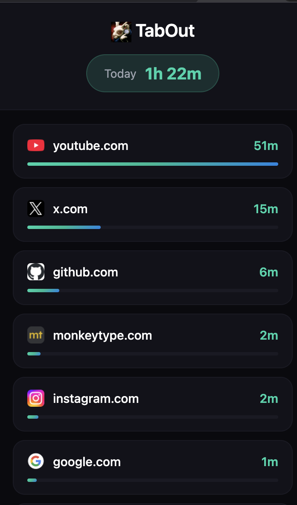
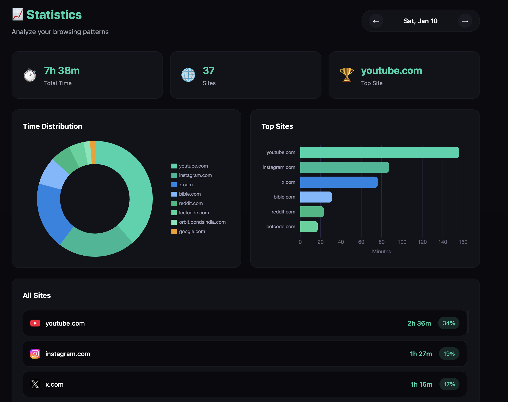
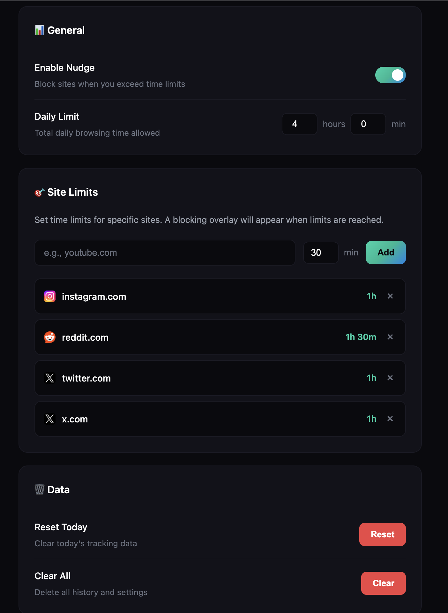

I wanted to keep track of where I'm spending most of my time in the browser. I searched in extension store and found none to my liking. so I thought of creating one myself (of course with some use of ai). so here it is **TabOut**.

## Features

TabOut helps you maintain healthy browsing habits with these key features:

- **Private & Secure**: All data is stored locally on your device. No external servers or tracking.
- **Automatic Time Tracking**: Seamlessly tracks how much time you spend on each website.
- **Visual Statistics**: View your browsing habits with beautiful charts and detailed analytics.
- **Smart Limits**: Set daily time limits for specific websites to stay productive.
- **Gentle Nudges**: Get a full-page blocking overlay when you exceed your set limits.

## How to Install

Since this is a custom extension, you can get the code from [GitHub](https://github.com/AntonyBush/TabOut) and install it in developer mode:

1. Download or clone the repository from [GitHub](https://github.com/AntonyBush/TabOut).
2. Open your browser's extensions page (navigate to `chrome://extensions` or `brave://extensions`).
3. Toggle on **Developer mode** in the top right corner.
4. Click the **Load unpacked** button.
5. Select the `TabOut` folder from your computer.
6. Don't forget to **pin the extension** to your toolbar for easy access! 📌

## Usage

Once installed, TabOut works automatically in the background.

1. **Check Your Stats**: Click the extension icon to see a quick summary of your top sites for the day.
   
   

2. **Dive Deeper**: Click the "Statistics" button in the popup to open the full dashboard with charts and weekly trends.

   

3. **Set Limits**: Open the Settings page to configure time limits for distracting sites. When you reach the limit, TabOut will help you get back on track.

   

---
*Open source and privacy-focused.*
